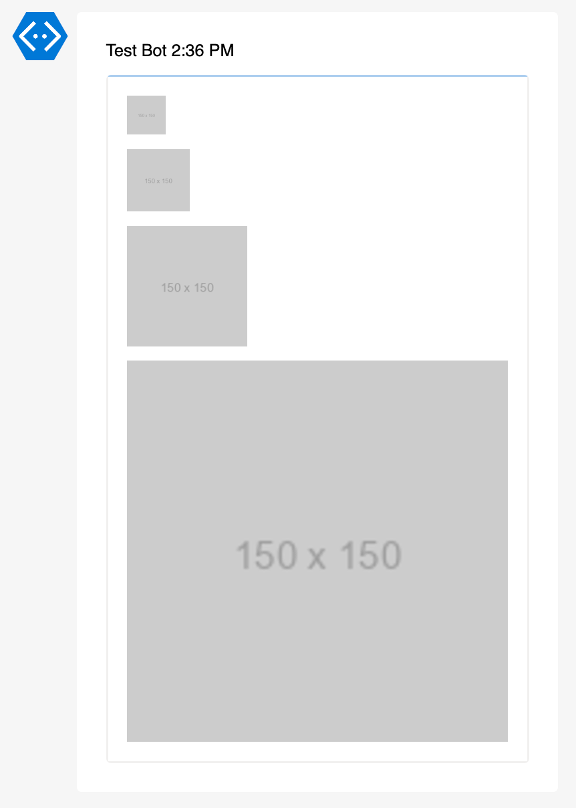

# Examples Add-AdaptiveCardImage

Function `Add-AdaptiveCardImage` adds a image element to an Adaptive Card.

## Image Parameters

| Parameter       | Default   | Available Values                                                       | Required | Description            |
| --------------- | --------- | ---------------------------------------------------------------------- | -------- | ---------------------- |
| `-AdaptiveCard` | -         | AdaptiveCard object                                                    | Yes      | Adaptive Card object   |
| `-Url`          | -         | Any valid URL                                                          | Yes      | Image URL              |
| `-AltText`      | -         | Any string                                                             | No       | Alt text for the image |
| `-Size`         | `auto`    | `auto`, `stretch`, `small`, `medium`, `large`                          | No       | Image size             |
| `-Width`        | -         | Number of pixels                                                       | No       | Image width px         |
| `-Height`       | -         | Number of pixels                                                       | No       | Image height           |
| `-HAlign`       | `left`    | `left`, `center`, `right`                                              | No       | Horizontal alignment   |
| `-Style`        | `default` | `default`, `person`                                                    | No       | Image style            |
| `-Spacing`      | `default` | `default`, `none`, `small`, `medium`, `large`, `extraLarge`, `padding` | No       | Space before the block |

## Examples

### Size

```powershell
Add-AdaptiveCardImage -AdaptiveCard $AdaptiveCard `
    -Url "https://via.placeholder.com/150" `
    -Size "small"

Add-AdaptiveCardImage -AdaptiveCard $AdaptiveCard `
    -Url "https://via.placeholder.com/150" `
    -Size "medium"

Add-AdaptiveCardImage -AdaptiveCard $AdaptiveCard `
    -Url "https://via.placeholder.com/150" `
    -Size "large"

Add-AdaptiveCardImage -AdaptiveCard $AdaptiveCard `
    -Url "https://via.placeholder.com/150" `
    -Size "stretch"
```



### Style

```powershell
Add-AdaptiveCardImage -AdaptiveCard $AdaptiveCard `
    -Url "https://via.placeholder.com/150" `
    -AltText "Placeholder image" `
    -Size "medium" `
    -HAlign "center" `
    -Style "person" `
```


