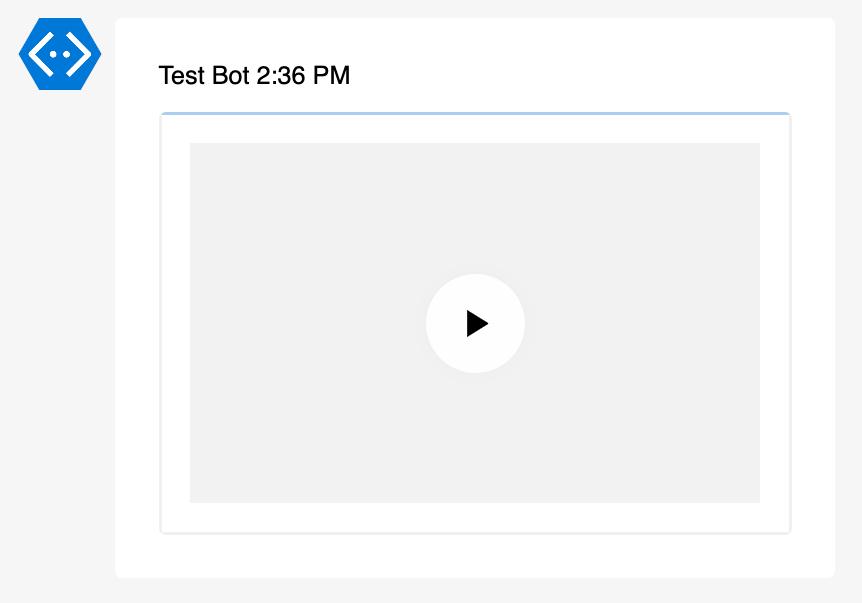

# Example Add-AdaptiveCardMedia

Function `Add-AdaptiveCardMedia` adds a media player to an Adaptive Card.

## Media Parameters

| Parameter       | Default     | Available Values                                                       | Required | Description            |
| --------------- | ----------- | ---------------------------------------------------------------------- | -------- | ---------------------- |
| `-AdaptiveCard` | -           | AdaptiveCard object                                                    | Yes      | Adaptive Card object   |
| `-Url`          | -           | Any valid URL                                                          | Yes      | Media URL              |
| `-Poster`       | -           | Any valid URL                                                          | No       | Poster image URL       |
| `-AltText`      | -           | Any string                                                             | No       | Alt text for the media |
| `-Height`       | `automatic` | `automatic`, `stretch`                                                 | No       | Media height           |
| `-Spacing`      | `default`   | `default`, `none`, `small`, `medium`, `large`, `extraLarge`, `padding` | No       | Space before the block |

## Examples

### Basic usage

```powershell
Add-AdaptiveCardMedia -AdaptiveCard $AdaptiveCard -Url "https://www.youtube.com/watch?v=jNQXAC9IVRw"
```



### Poster

```powershell
Add-AdaptiveCardMedia -AdaptiveCard $AdaptiveCard `
    -Url "https://www.youtube.com/watch?v=jNQXAC9IVRw" `
    -AltText "Me at the zoo" `
    -Poster "https://img.youtube.com/vi/jNQXAC9IVRw/default.jpg" `
    -Height "Stretch"
```


