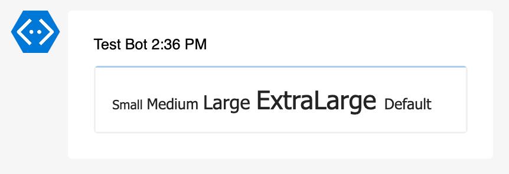
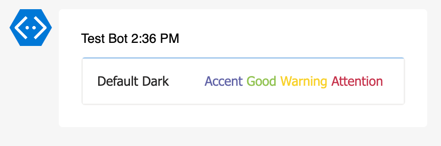
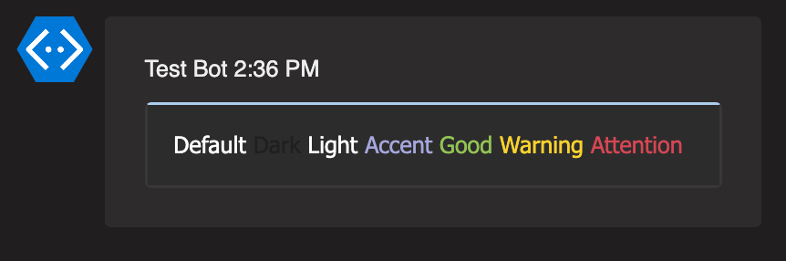
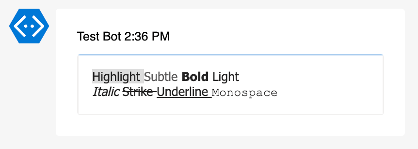
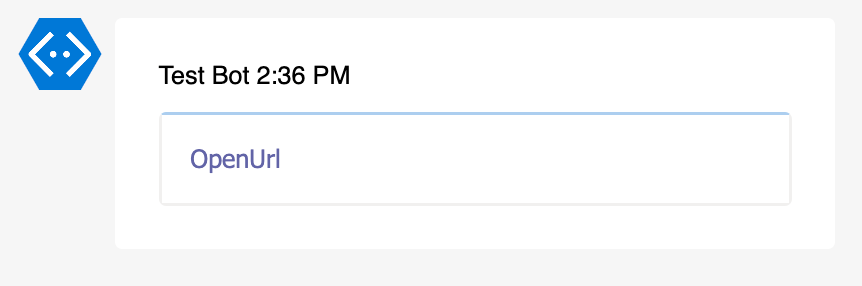
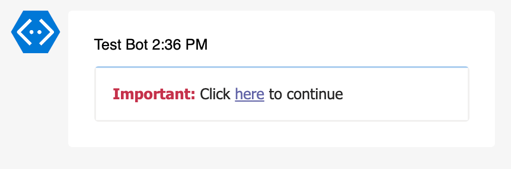
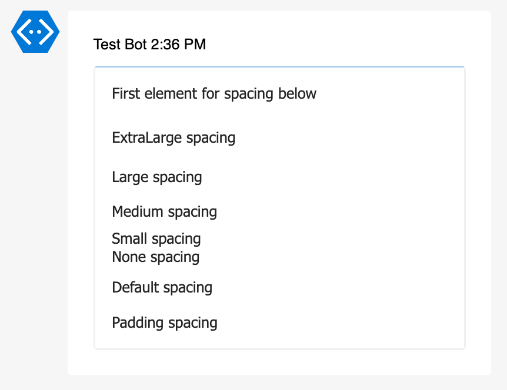

# Examples Add-AdaptiveCardRichTextBlock

Function `Add-AdaptiveCardRichTextBlock` adds a RichTextBlock element to an Adaptive Card.

## Rich Text Block Parameters

You can add up to 9 text segments. Each text segment (Text1 through Text9) can have its own style parameters:

| Parameter         | Default   | Available Values                                                       | Required | Description                  |
| ----------------- | --------- | ---------------------------------------------------------------------- | -------- | ---------------------------- |
| `-AdaptiveCard`   | -         | AdaptiveCard object                                                    | Yes      | Adaptive Card object         |
| `-Spacing`        | `default` | `default`, `none`, `small`, `medium`, `large`, `extraLarge`, `padding` | No       | Space before the block       |
| `-HAlign`         | `left`    | `left`, `center`, `right`                                              | No       | Horizontal alignment block   |
| `-TextN`          | -         | Any string. Markdown not supported.                                    | Yes      | Text content for segment N   |
| `-WeightN`        | `default` | `default`, `lighter`, `bolder`                                         | No       | Text weight for segment N    |
| `-SizeN`          | `default` | `default`, `small`, `medium`, `large`, `extraLarge`                    | No       | Text size for segment N      |
| `-ColorN`         | `default` | `default`, `dark`, `light`, `accent`, `good`, `warning`, `attention`   | No       | Text color for segment N     |
| `-SelectActionN`  | `OpenUrl` | `Execute`, `OpenUrl`, `Submit`, `ToggleVisibility`                     | No       | Action for segment N         |
| `-UrlN`           | -         | Any valid URL                                                          | No       | URL for segment N            |
| `-FontTypeN`      | `default` | `default`, `monospace`                                                 | No       | Font type for the block      |
| `-HighlightN`     | `false`   | `true/false`                                                           | No       | Highlight text for segment N |
| `-IsSubtleN`      | `false`   | `true/false`                                                           | No       | Subtle text for segment N    |
| `-ItalicN`        | `false`   | `true/false`                                                           | No       | Italic text for segment N    |
| `-StrikethroughN` | `false`   | `true/false`                                                           | No       | Strikethrough text for seg N |
| `-UnderlineN`     | `false`   | `true/false`                                                           | No       | Underline text for segment N |

## Examples

### Size

```powershell
Add-AdaptiveCardRichTextBlock -AdaptiveCard $AdaptiveCard `
    -Text1 "Small " -Size1 "small" `
    -Text2 "Medium " -Size2 "medium" `
    -Text3 "Large " -Size3 "large" `
    -Text4 "ExtraLarge " -Size4 "extraLarge" `
    -Text5 "Default"
```



### Colors

```powershell
Add-AdaptiveCardRichTextBlock -AdaptiveCard $AdaptiveCard `
    -Text1 "Default " -Color1 "default" `
    -Text2 "Dark " -Color2 "dark" `
    -Text3 "Light " -Color3 "light" `
    -Text4 "Accent " -Color4 "accent" `
    -Text5 "Good " -Color5 "good" `
    -Text6 "Warning " -Color6 "warning" `
    -Text7 "Attention" -Color7 "attention"
```





### Decorations

```powershell
Add-AdaptiveCardRichTextBlock -AdaptiveCard $AdaptiveCard `
    -Text1 "Highlight " -Highlight1 `
    -Text2 "Subtle " -IsSubtle2 `
    -Text3 "Bold " -Weight3 "bolder" `
    -Text4 "Light `n" -Weight4 "lighter" `
    -Text5 "Italic " -Italic5 `
    -Text6 "Strike " -Strikethrough6 `
    -Text7 "Underline " -Underline7 `
    -Text8 "Monospace" -FontType8 "monospace"
```



### Links

```powershell
Add-AdaptiveCardRichTextBlock -AdaptiveCard $AdaptiveCard `
    -Text1 "OpenUrl " -Url1 "https://example.com" `
```



### Combined

```powershell
Add-AdaptiveCardRichTextBlock -AdaptiveCard $AdaptiveCard `
    -Text1 "Important: " -Weight1 "bolder" -Color1 "attention" `
    -Text2 "Click " `
    -Text3 "here" -Underline3 -Color3 "accent" -Url3 "https://example.com" `
    -Text4 " to continue"
```



### Spacing

```powershell
Add-AdaptiveCardRichTextBlock -AdaptiveCard $AdaptiveCard `
    -Text1 "First element for spacing below"

Add-AdaptiveCardRichTextBlock -AdaptiveCard $AdaptiveCard -Spacing "extraLarge" `
    -Text1 "ExtraLarge spacing"
Add-AdaptiveCardRichTextBlock -AdaptiveCard $AdaptiveCard -Spacing "large" `
    -Text1 "Large spacing"
Add-AdaptiveCardRichTextBlock -AdaptiveCard $AdaptiveCard -Spacing "medium" `
    -Text1 "Medium spacing"
Add-AdaptiveCardRichTextBlock -AdaptiveCard $AdaptiveCard -Spacing "small" `
    -Text1 "Small spacing"
Add-AdaptiveCardRichTextBlock -AdaptiveCard $AdaptiveCard -Spacing "none" `
    -Text1 "None spacing"
Add-AdaptiveCardRichTextBlock -AdaptiveCard $AdaptiveCard -Spacing "default" `
    -Text1 "Default spacing"
Add-AdaptiveCardRichTextBlock -AdaptiveCard $AdaptiveCard -Spacing "padding" `
    -Text1 "Padding spacing"
```


