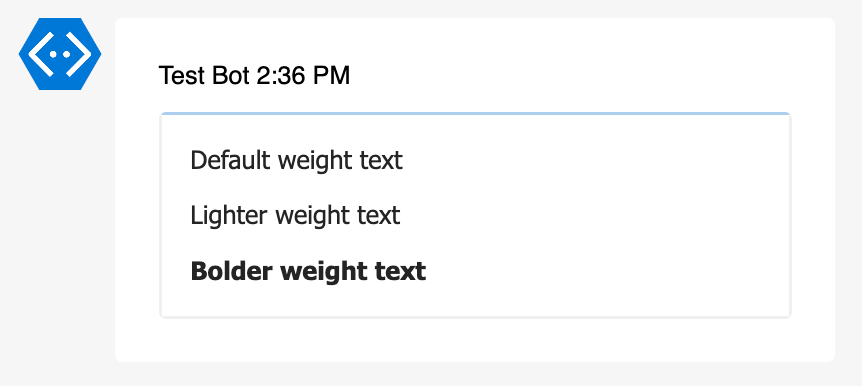
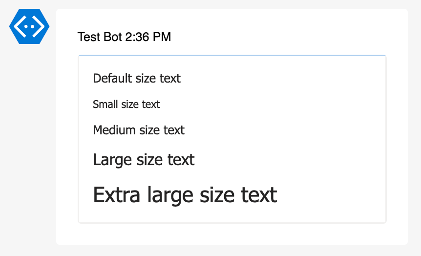
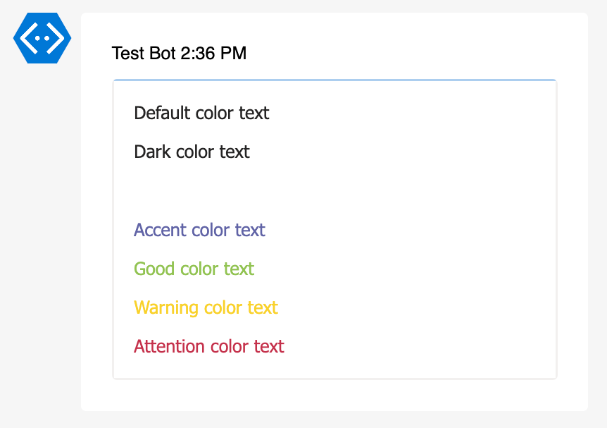
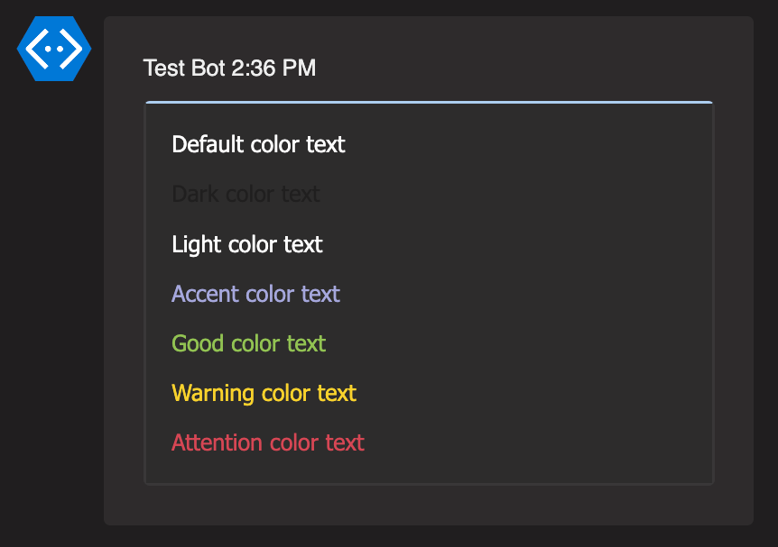
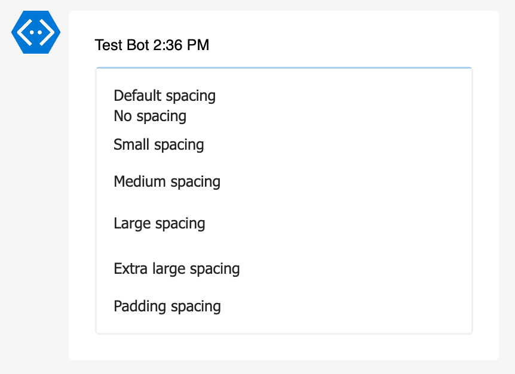
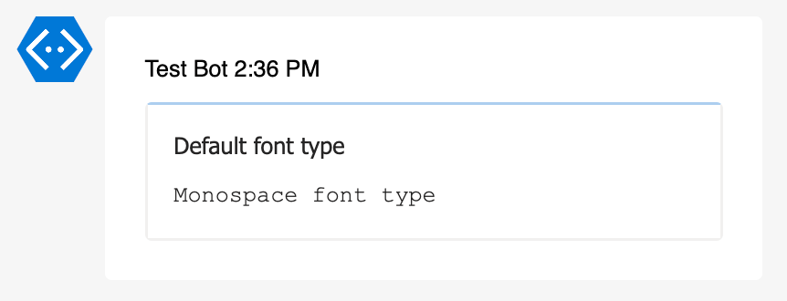
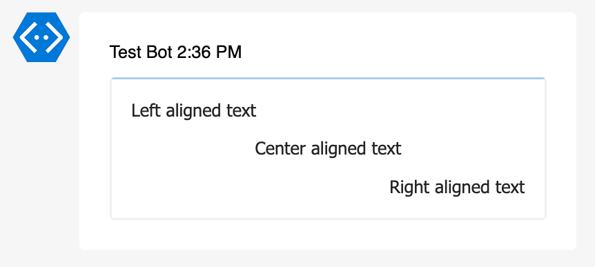
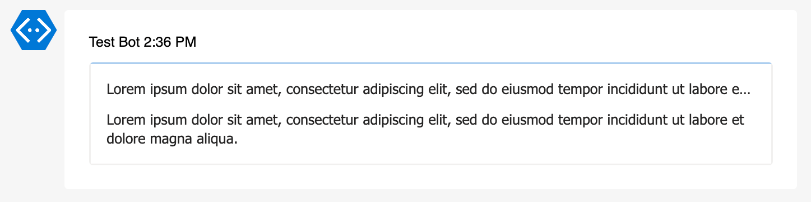
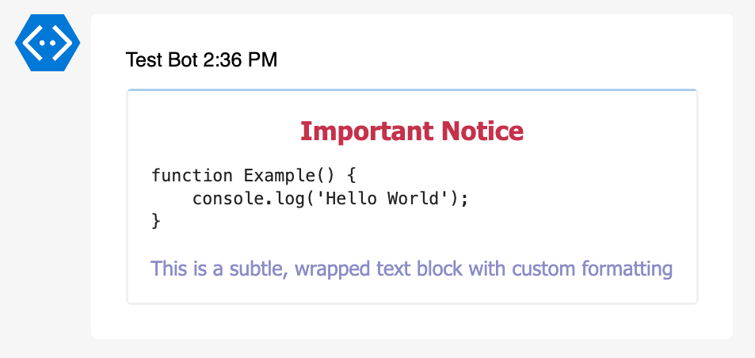
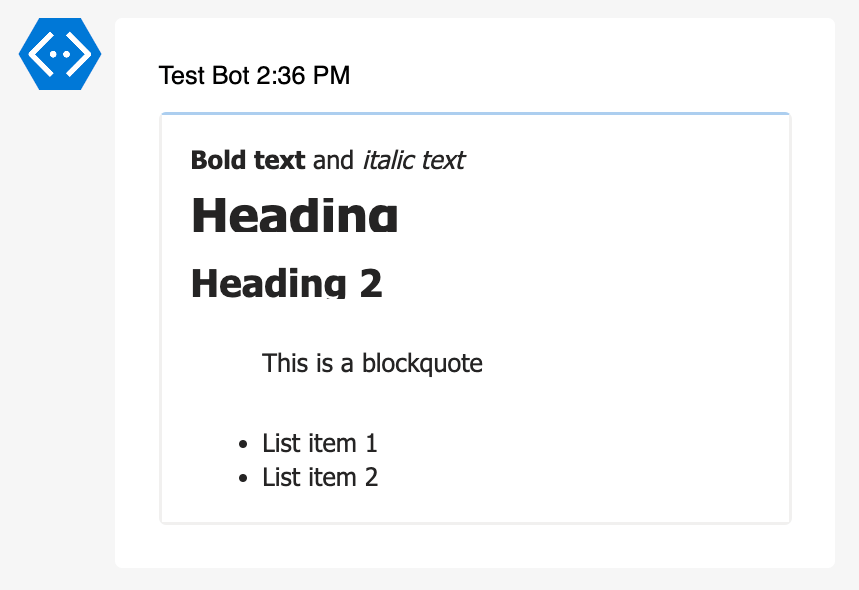

# Example Add-AdaptiveCardTextBlock

Function `Add-AdaptiveCardTextBlock` adds a TextBlock element to an Adaptive Card.

## Text Block Parameters

| Parameter       | Default   | Available Values                                                       | Required | Description            |
| --------------- | --------- | ---------------------------------------------------------------------- | -------- | ---------------------- |
| `-AdaptiveCard` | -         | AdaptiveCard object                                                    | Yes      | Adaptive Card object   |
| `-Text`         | -         | Any string. Markdown supported.                                        | Yes      | Text content           |
| `-Weight`       | `default` | `default`, `lighter`, `bolder`                                         | No       | Text weight            |
| `-Size`         | `default` | `default`, `small`, `medium`, `large`, `extraLarge`                    | No       | Text size              |
| `-Color`        | `default` | `default`, `dark`, `light`, `accent`, `good`, `warning`, `attention`   | No       | Text color             |
| `-Spacing`      | `default` | `default`, `none`, `small`, `medium`, `large`, `extraLarge`, `padding` | No       | Space before the block |
| `-FontType`     | `default` | `default`, `monospace`                                                 | No       | Font type              |
| `-HAlign`       | `left`    | `left`, `center`, `right`                                              | No       | Horizontal alignment   |
| `-IsSubtle`     | -         | `true/false`                                                           | No       | Subtle text            |
| `-MaxLines`     | -         | Integer                                                                | No       | Maximum lines          |
| `-Wrap`         | -         | `true/false`                                                           | No       | Wrap text              |

## Examples

### Basic usage with required parameters

```powershell
Add-AdaptiveCardTextBlock -AdaptiveCard $AdaptiveCard -Text "Basic text block"
```


### Text weight

```powershell
Add-AdaptiveCardTextBlock -AdaptiveCard $AdaptiveCard -Text "Default weight text" -Weight default
Add-AdaptiveCardTextBlock -AdaptiveCard $AdaptiveCard -Text "Lighter weight text" -Weight lighter
Add-AdaptiveCardTextBlock -AdaptiveCard $AdaptiveCard -Text "Bolder weight text" -Weight bolder
```



### Text sizes

```powershell
Add-AdaptiveCardTextBlock -AdaptiveCard $AdaptiveCard -Text "Default size text" -Size default
Add-AdaptiveCardTextBlock -AdaptiveCard $AdaptiveCard -Text "Small size text" -Size small
Add-AdaptiveCardTextBlock -AdaptiveCard $AdaptiveCard -Text "Medium size text" -Size medium
Add-AdaptiveCardTextBlock -AdaptiveCard $AdaptiveCard -Text "Large size text" -Size large
Add-AdaptiveCardTextBlock -AdaptiveCard $AdaptiveCard -Text "Extra large size text" -Size extraLarge
```



### Text colors

```powershell
Add-AdaptiveCardTextBlock -AdaptiveCard $AdaptiveCard -Text "Default color text" -Color default
Add-AdaptiveCardTextBlock -AdaptiveCard $AdaptiveCard -Text "Dark color text" -Color dark
Add-AdaptiveCardTextBlock -AdaptiveCard $AdaptiveCard -Text "Light color text" -Color light
Add-AdaptiveCardTextBlock -AdaptiveCard $AdaptiveCard -Text "Accent color text" -Color accent
Add-AdaptiveCardTextBlock -AdaptiveCard $AdaptiveCard -Text "Good color text" -Color good
Add-AdaptiveCardTextBlock -AdaptiveCard $AdaptiveCard -Text "Warning color text" -Color warning
Add-AdaptiveCardTextBlock -AdaptiveCard $AdaptiveCard -Text "Attention color text" -Color attention
```





### Spacing options

```powershell
Add-AdaptiveCardTextBlock -AdaptiveCard $AdaptiveCard -Text "Default spacing" -Spacing default
Add-AdaptiveCardTextBlock -AdaptiveCard $AdaptiveCard -Text "No spacing" -Spacing none
Add-AdaptiveCardTextBlock -AdaptiveCard $AdaptiveCard -Text "Small spacing" -Spacing small
Add-AdaptiveCardTextBlock -AdaptiveCard $AdaptiveCard -Text "Medium spacing" -Spacing medium
Add-AdaptiveCardTextBlock -AdaptiveCard $AdaptiveCard -Text "Large spacing" -Spacing large
Add-AdaptiveCardTextBlock -AdaptiveCard $AdaptiveCard -Text "Extra large spacing" -Spacing extraLarge
Add-AdaptiveCardTextBlock -AdaptiveCard $AdaptiveCard -Text "Padding spacing" -Spacing padding
```



### Font types

```powershell
Add-AdaptiveCardTextBlock -AdaptiveCard $AdaptiveCard -Text "Default font type" -FontType default
Add-AdaptiveCardTextBlock -AdaptiveCard $AdaptiveCard -Text "Monospace font type" -FontType monospace
```



### Horizontal alignment

```powershell
Add-AdaptiveCardTextBlock -AdaptiveCard $AdaptiveCard -Text "Left aligned text" -HAlign left
Add-AdaptiveCardTextBlock -AdaptiveCard $AdaptiveCard -Text "Center aligned text" -HAlign center
Add-AdaptiveCardTextBlock -AdaptiveCard $AdaptiveCard -Text "Right aligned text" -HAlign right
```



### Subtle text

```powershell
Add-AdaptiveCardTextBlock -AdaptiveCard $AdaptiveCard -Text "Regular text" # Not subtle
Add-AdaptiveCardTextBlock -AdaptiveCard $AdaptiveCard -Text "Subtle text" -IsSubtle
```


### Text wrapping

```powershell
Add-AdaptiveCardTextBlock -AdaptiveCard $AdaptiveCard -Text "Lorem ipsum dolor sit amet, consectetur adipiscing elit, sed do eiusmod tempor incididunt ut labore et dolore magna aliqua."
Add-AdaptiveCardTextBlock -AdaptiveCard $AdaptiveCard -Text "Lorem ipsum dolor sit amet, consectetur adipiscing elit, sed do eiusmod tempor incididunt ut labore et dolore magna aliqua." -Wrap
```



### Max lines

Use `-Wrap` parameter to enable text wrapping.

```powershell
Add-AdaptiveCardTextBlock -AdaptiveCard $AdaptiveCard -Text "Lorem ipsum dolor sit amet, consectetur adipiscing elit, sed do eiusmod tempor incididunt ut labore et dolore magna aliqua. Ut enim ad minim veniam, quis nostrud exercitation ullamco laboris nisi ut aliquip ex ea commodo consequat." -MaxLines 2  -Wrap
```


### Combinations of multiple parameters

```powershell
Add-AdaptiveCardTextBlock -AdaptiveCard $AdaptiveCard `
    -Text "**Important Notice**" `
    -Weight bolder `
    -Size large `
    -Color attention `
    -HAlign center `
    -Spacing large

Add-AdaptiveCardTextBlock -AdaptiveCard $AdaptiveCard `
    -Text "
    function Example() {
        console.log('Hello World');
    }
    " `
    -FontType monospace `
    -Size small `
    -Wrap

Add-AdaptiveCardTextBlock -AdaptiveCard $AdaptiveCard `
    -Text "This is a subtle, wrapped text block with custom formatting" `
    -IsSubtle `
    -Wrap `
    -MaxLines 3 `
    -Size medium `
    -Color accent `
    -HAlign left `
    -Spacing medium
```



### Markdown examples

```powershell
Add-AdaptiveCardTextBlock -AdaptiveCard $AdaptiveCard -Text "**Bold text** and *italic text*"
Add-AdaptiveCardTextBlock -AdaptiveCard $AdaptiveCard -Text "# Heading `n## Heading 2"
Add-AdaptiveCardTextBlock -AdaptiveCard $AdaptiveCard -Text "> This is a blockquote"
Add-AdaptiveCardTextBlock -AdaptiveCard $AdaptiveCard -Text "- List item 1`n- List item 2"
```


