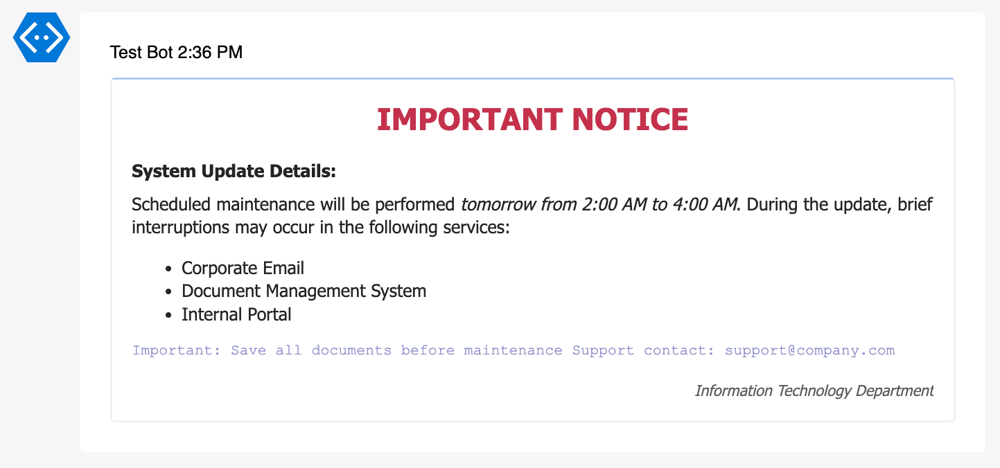
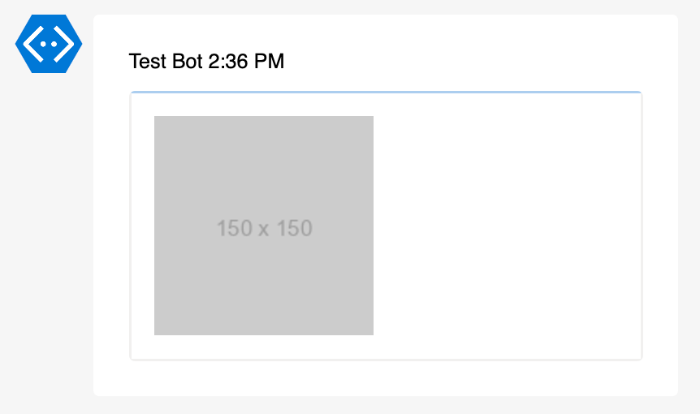

# AdaptiveCard PowerShell Module

[](https://www.powershellgallery.com/packages/AdaptiveCard)
[](https://www.powershellgallery.com/packages/AdaptiveCard)


**Official Adaptive Cards repository:** [github.com/microsoft/AdaptiveCards](https://github.com/microsoft/AdaptiveCards)

## Overview

AdaptiveCard is a PowerShell module that enables creation and sending of Adaptive Cards - a card-based UI framework that works across multiple platforms including Microsoft Teams.

Module using Adaptive Cards schema version 1.5. Be sure what your target platform supports any [features you are using](https://github.com/Microsoft/AdaptiveCards/?tab=readme-ov-file#supported-features).

## Installation

The module is available through the [PowerShell Gallery](https://powershellgallery.com/packages/AdaptiveCard/).

```powershell
# Install the module
Install-Module -Name AdaptiveCard

# Update to the latest version
Update-Module -Name AdaptiveCard

# Remove the module if needed
Uninstall-Module -Name AdaptiveCard
```

## Usage

### Creating an Adaptive Card

Start by creating a new Adaptive Card object:

```powershell
$AdaptiveCard = New-AdaptiveCard
```

### Adding Text Block

Add a text block to the card. TextBlock supports markdown formatting:

```powershell
Add-AdaptiveCardTextBlock -AdaptiveCard $AdaptiveCard `
   -Text "**IMPORTANT NOTICE**" `
   -Size extraLarge `
   -Weight bolder `
   -Color attention `
   -HAlign center `
   -Spacing large

Add-AdaptiveCardTextBlock -AdaptiveCard $AdaptiveCard `
   -Text "System Update Details:" `
   -Size medium `
   -Weight bolder `
   -Spacing medium

Add-AdaptiveCardTextBlock -AdaptiveCard $AdaptiveCard `
   -Text "Scheduled maintenance will be performed *tomorrow from 2:00 AM to 4:00 AM*. During the update, brief interruptions may occur in the following services:
- Corporate Email
- Document Management System
- Internal Portal" `
   -Wrap `
   -Size default `
   -Color default `
   -Spacing small

Add-AdaptiveCardTextBlock -AdaptiveCard $AdaptiveCard `
   -Text "
Important: Save all documents before maintenance `n
Support contact: support@company.com
" `
   -FontType monospace `
   -Size small `
   -Color accent `
   -IsSubtle

Add-AdaptiveCardTextBlock -AdaptiveCard $AdaptiveCard `
   -Text "_Information Technology Department_" `
   -Size small `
   -HAlign right `
   -IsSubtle `
   -Spacing medium
```



More examples can be found in the [Text Block documentation](Examples_Add-AdaptiveCardTextBlock.md).

### Adding Rich Text Block

Rich text blocks allow combining multiple text elements with different styles. Maximum of 9 text elements can be combined. RichTextBlock not support markdown formatting.

```powershell
# Example 1 - Formatted System Notification
Add-AdaptiveCardRichTextBlock -AdaptiveCard $AdaptiveCard `
   -Text1 "IMPORTANT: `n" -Weight1 "bolder" -Size1 "large" -Color1 "attention" `
   -Text2 "System Update " -Weight2 "bolder" `
   -Text3 "scheduled for " `
   -Text4 "3:00 PM" -FontType4 "monospace" -Color4 "accent" `
   -Text5 ". `nPlease " `
   -Text6 "save" -Italic6 -Underline6 `
   -Text7 " all your work. `n" `
   -Text8 "Details" -Color8 "accent" -Url8 "https://example.com" `
   -Text9 " (opens in new window)" -Size9 "small" -IsSubtle9
```


```powershell
# Example 2 - Task Status Overview
Add-AdaptiveCardRichTextBlock -AdaptiveCard $AdaptiveCard `
   -Text1 "[DONE] " -Color1 "good" -Weight1 "bolder" `
   -Text2 "Data Analysis `n" -Strikethrough2 -IsSubtle2 `
   -Text3 "[IN PROGRESS] " -Color3 "warning" -Weight3 "bolder" `
   -Text4 "Testing " -Highlight4 `
   -Text5 "(3/10) `n" -FontType5 "monospace" -Size5 "small" `
   -Text6 "[BLOCKED] " -Color6 "attention" -Weight6 "bolder" `
   -Text7 "Deployment `n" `
   -Text8 "Error: " -Size8 "small" -Color8 "attention" `
   -Text9 "DB-256" -FontType9 "monospace" -Url9 "https://issues/DB-256"
```


More examples can be found in the [Rich Text Block documentation](Examples_Add-AdaptiveCardRichTextBlock.md).

### Adding Images

```powershell
Add-AdaptiveCardImage -AdaptiveCard $AdaptiveCard -Url "https://via.placeholder.com/150" -AltText "Placeholder image"
```



More examples can be found in the [Image documentation](Examples_Add-AdaptiveCardImage.md).

### Adding Media

Displays a media player for audio or video content.

```powershell
Add-AdaptiveCardMedia -AdaptiveCard $AdaptiveCard `
    -Url "https://www.youtube.com/watch?v=jNQXAC9IVRw" `
    -AltText "Me at the zoo" `
    -Poster "https://img.youtube.com/vi/jNQXAC9IVRw/default.jpg" `
    -Height "Stretch"
```


More examples can be found in the [Media documentation](Examples_Add-AdaptiveCardMedia.md).

### Adding Fact Set

Fact sets are used to display a series of facts (name/value pairs) in a tabular format.

```powershell
Add-AdaptiveCardFactSet -AdaptiveCard $AdaptiveCard `
   -Fact1 "Status" -Value1 "In Progress" `
   -Fact2 "Priority" -Value2 "High" `
   -Fact3 "Assigned to" -Value3 "John Doe" `
   -Fact4 "Due date" -Value4 "2021-12-31"
```


More examples can be found in the [Fact Set documentation](Examples_Add-AdaptiveCardFactSet.md).

### Sending to Microsoft Teams

To send the card to Microsoft Teams, you'll need a webhook URL:

```powershell
# Example url for send adaptive card to Microsoft Teams
$WorkflowUrl = "https://prod-11.westeurope.logic.azure.com:443/workflows/..."

Send-AdaptiveCardToTeams -AdaptiveCard $AdaptiveCard -Workflow $WorkflowUrl
```
