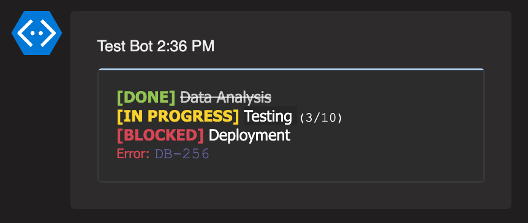

# AdaptiveCard PowerShell Module

## Overview

AdaptiveCard is a PowerShell module that enables creation and sending of Adaptive Cards - a card-based UI framework that works across multiple platforms including Microsoft Teams.

## Installation

The module is available through the [PowerShell Gallery](https://powershellgallery.com/packages/AdaptiveCard/).

```powershell
# Install the module
Install-Module -Name AdaptiveCard

# Update to the latest version
Update-Module -Name AdaptiveCard

# Remove the module if needed
Uninstall-Module -Name AdaptiveCard
```

## Usage

### Creating an Adaptive Card

Start by creating a new Adaptive Card object:

```powershell
$AdaptiveCard = New-AdaptiveCard
```

### Adding Text Blocks

#### Simple Text Block

```powershell
Add-AdaptiveCardTextBlock -AdaptiveCard $AdaptiveCard -Text "Hello World!"
```


#### Customized Text Block

```powershell
Add-AdaptiveCardTextBlock -AdaptiveCard $AdaptiveCard `
    -Text "Hello World!" `
    -Weight "bolder" `
    -Size "large" `
    -Color "accent" `
    -Spacing "small"
```


##### Text Block Parameters

| Parameter | Description | Default | Available Values |
|-----------|-------------|---------|------------------|
| `-Spacing` | Space between elements | `default` | `default`, `none`, `small`, `medium`, `large`, `extraLarge`, `padding` |
| `-Weight` | Text weight | `default` | `default`, `lighter`, `bolder` |
| `-Size` | Text size | `default` | `default`, `small`, `medium`, `large`, `extraLarge` |
| `-Color` | Text color | `default` | `default`, `dark`, `light`, `accent`, `good`, `warning`, `attention` |

### Rich Text Blocks

Rich text blocks allow combining multiple text elements with different styles. Maximum of 5 text elements can be combined:

```powershell
Add-AdaptiveCardRichTextBlock -AdaptiveCard $AdaptiveCard `
    -Text1 "Text one" -Text2 "`nText two" -Text3 "Text three" `
    -Text4 " Text four" -Text5 "`nText five"
```


Additional parameters:

`-Spacing` - The amount of space between this element and the previous element. Default is `default`. Available values are `default`, `none`, `small`, `medium`, `large`, `extraLarge`, `padding`.

`-Weight1`/`-Weight2` - The weight of the Text1. Default is `default`. Available values are `default`, `lighter`, `bolder`.

`-Size1`/`-Size2` - The size of the Text1. Default is `default`. Available values are `default`, `small`, `medium`, `large`, `extraLarge`.

`-Color1`/`-Color2` - The color of the Text1. Default is `default`. Available values are `default`, `dark`, `light`, `accent`, `good`, `warning`, `attention`.

```powershell
Add-AdaptiveCardRichTextBlock -AdaptiveCard $AdaptiveCard -Spacing "default" `
    -Text1 "Bolder large attention. " -Weight1 "bolder" -Size1 "large" -Color1 "accent" `
    -Text2 "Lighter medium accent." -Weight2 "lighter" -Size2 "medium" -Color2 "attention"

Add-AdaptiveCardRichTextBlock -AdaptiveCard $AdaptiveCard -Spacing "None" `
    -Text1 "No Spacing Bolder extraLarge warning. " -Weight1 "bolder" -Size1 "large" -Color1 "warning" `
    -Text2 "Default small good." -Weight2 "default" -Size2 "small" -Color2 "good"

Add-AdaptiveCardRichTextBlock -AdaptiveCard $AdaptiveCard -Spacing "padding" `
    -Text1 "Padding bolder large light. " -Weight1 "bolder" -Size1 "large" -Color1 "light" `
    -Text2 "Lighter extraLarge dark" -Weight2 "lighter" -Size2 "extraLarge" -Color2 "dark" `
    -Text3 "Bolder medium default" -Weight3 "bolder" -Size3 "medium" -Color3 "default" `
    -Text4 "Lighter small accent" -Weight4 "lighter" -Size4 "small" -Color4 "accent" `
    -Text5 "Bolder large good" -Weight5 "bolder" -Size5 "large" -Color5 "good"
```

Light theme result:


Dark theme result:


#### Rich Text Block Parameters

Each text segment (Text1 through Text5) can have its own style parameters:

| Parameter | Description | Default | Available Values |
|-----------|-------------|---------|------------------|
| `-TextN` | Text content for segment N | - | Any string |
| `-WeightN` | Text weight for segment N | `default` | `default`, `lighter`, `bolder` |
| `-SizeN` | Text size for segment N | `default` | `default`, `small`, `medium`, `large`, `extraLarge` |
| `-ColorN` | Text color for segment N | `default` | `default`, `dark`, `light`, `accent`, `good`, `warning`, `attention` |
| `-Spacing` | Space before the block | `default` | `default`, `none`, `small`, `medium`, `large`, `extraLarge`, `padding` |

### Sending to Microsoft Teams

To send the card to Microsoft Teams, you'll need a webhook URL:

```powershell
# Example url for send adaptive card to Microsoft Teams
$WorkflowUrl = "https://prod-11.westeurope.logic.azure.com:443/workflows/..."

Send-AdaptiveCardToTeams -AdaptiveCard $AdaptiveCard -Workflow $WorkflowUrl
```

## Theme Support

The module supports both light and dark themes in Microsoft Teams. Colors will automatically adjust based on the user's theme settings, as shown in the examples above.
